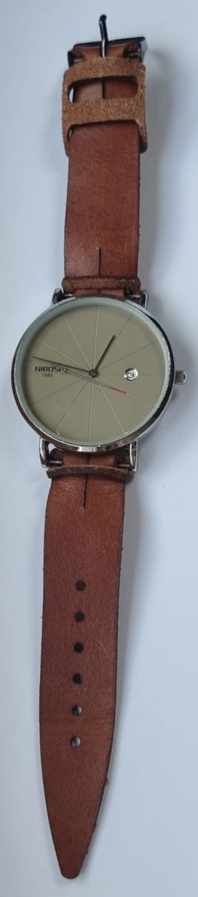

# ⚡ Laser File Generator for Leather Products 👛

This software aims to generate vector files as input-templates for leather products produced with a laser cutter. 

The products are designed in an origami fashion to minimize the manual assembly work and tools needed to create them.

## Products
### Glasses Cover

### Pencilcase

### Phonecase (Dynamic)

### Portemonnaie / Wallet

### Watchstrap (Dynamic)

## Personalization 
The Dynamic files can be adjusted with parameters to fit the specific needs.
You can personalize **all** products with your name.

## Assembly 

You have to insert the leashes into the fitting holes. This technique can be observed in the following videos:

Wallet | Glasses-Cover
:-: | :-:
<video src='preview_images/wallet-assembly.mp4' width=180/> | <video src='preview_images/glass-cover-assembly.mp4' width=180/>

## How to use the software
1. Install [Docker](www.docker.com) 
2. Install [Docker-Compose](https://docs.docker.com/compose/install/) on your computer
3. Navigate with your terminal to this folder (Root - where this file is placed)
4. Run `docker-compose up -d --build`
5. Grab a coffee, it takes a while...
6. Open your browser and open this [page](http://0.0.0.0:5000/)
7. Voilá 

If you want to stop the application, run `docker-compose down`.
